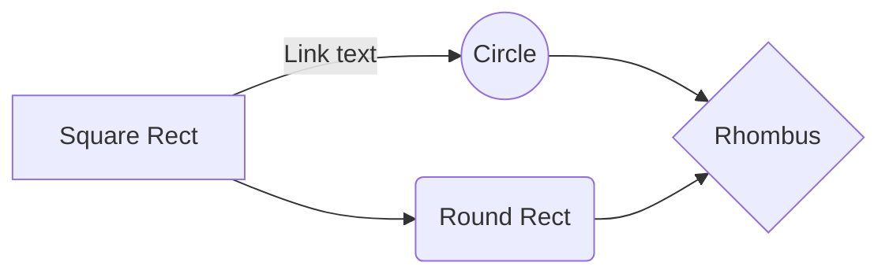
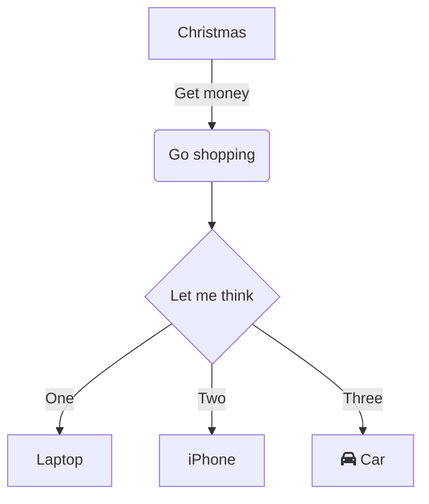
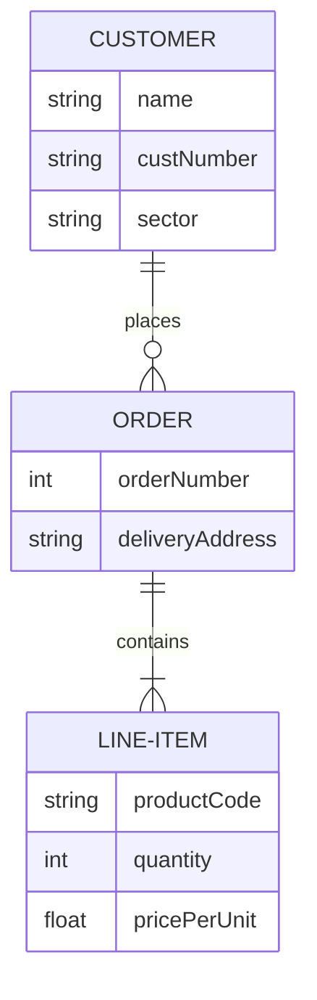
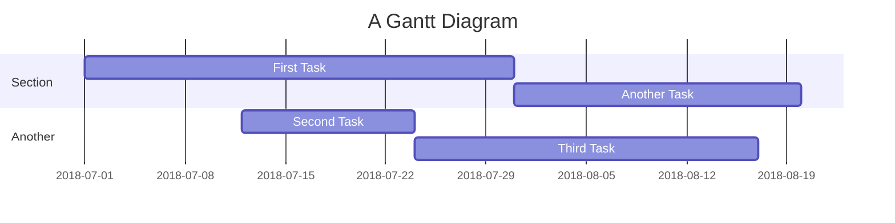
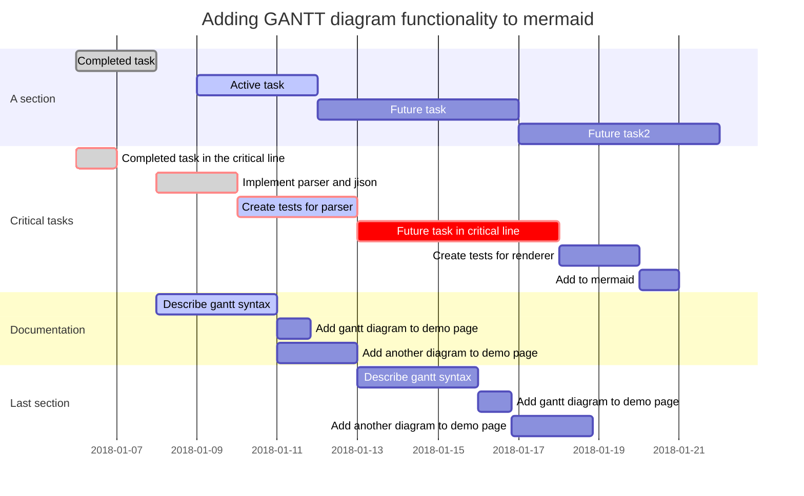

# UTILIZZO MD

il  linguaggio di markup (in inglese, markup language) è un insieme di regole che descrivono i meccanismi di rappresentazione di un testo che, utilizzando convenzioni standardizzate, sono utilizzabili su più supporti.

Il linguaggio di markup è un linguaggio formale che utilizza convenzioni standardizzate per la marcatura di un testo in modo da associare significato semantico a porzioni di esso. È spesso utilizzato per la formattazione di documenti testuali in modo da renderli più espressivi e facilmente interpretabili, ma può anche essere utilizzato, come nel caso dell'HTML, per definire la struttura logica di un documento e la sua formattazione.

> Installare estensione GitHub Markdown Preview

# Titolo principale
## Sottotitolo 1
### Titolo paragrafo
#### Sottotitolo paragrafo
---

> esempio di quote (citazione)

esempio di __grassetto__ o **bold**

esempio di _italic_

# esempio di elenco puntato
---
- primo
    - sottoelenco
- secondo
    - sottoelenco
- terzo
- quarto
- quinto

# esempio di elenco numerato
---
1. primo
2. secondo
3. terzo
    1. quarto
    2. quinto
        1. sesto
        2. settimo
        3. ottavo
            1. nono
            2. decimo
            3. Undicesimo

## esempio di check
- [x] sddsfsdsf
- [ ] primo
- [ ] secondo
- [x] terzo

# Esempio di codice
```
git status
git add
git commit
```


```c# 
class Program
{
    static void Main(string[] args)
    {
       Console.WriteLine("Hello World!");
    }
}

/*
note per i collaboratori
*/
```

**esempio di link relativo**

[link a pagina 2](02_link.md)

[link a pagina web](https://www.google.com)

[link a pagina 3 dentro la sub](/Esercitazioni/02_md/subfolder/03_link.md)

[link ad una section del documento](#esempio-di-elenco-puntato)

<!-- Commento che non compare nel render markdown -->

| Syntax | Description |
| ----------- | ----------- |
| Header | Title |
| Paragraph | ![esempio di SVG di svg repo]|


<font color="red">Testo scritto in rosso!</font>

### Sezioni

<details>

<summary>Tips for collapsed sections</summary>

### You can add a header

You can add text within a collapsed section. 

You can add an image or a code block, too.

```ruby
   puts "Hello World"
```

</details>
Here is a simple flow chart:

` esempio di mark con i backtick `

<mark>gedfgdfg</mark>

<mark style=" background:red">gedfgdfg</mark>

## GRAFICI MERMAID

https://mermaid.js.org/
https://jojozhuang.github.io/tutorial/mermaid-cheat-sheet/

## FLOWCHART BASIC


## FLOWCHART BASIC



## FLOWCHART WITH DECISION



# FLOWCHART DATA



## GRAFICI GANTT



